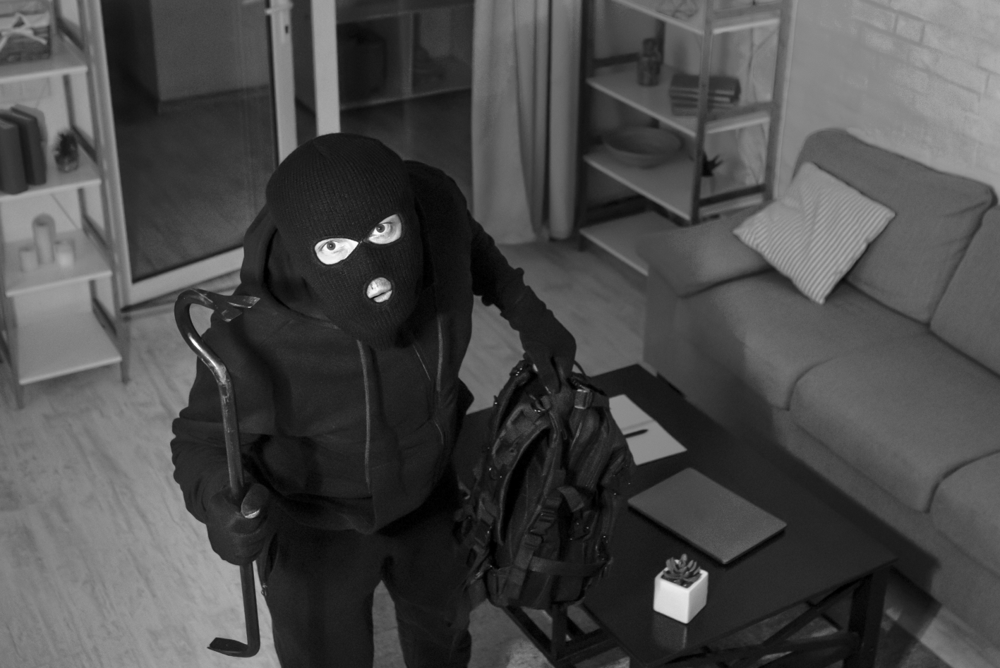
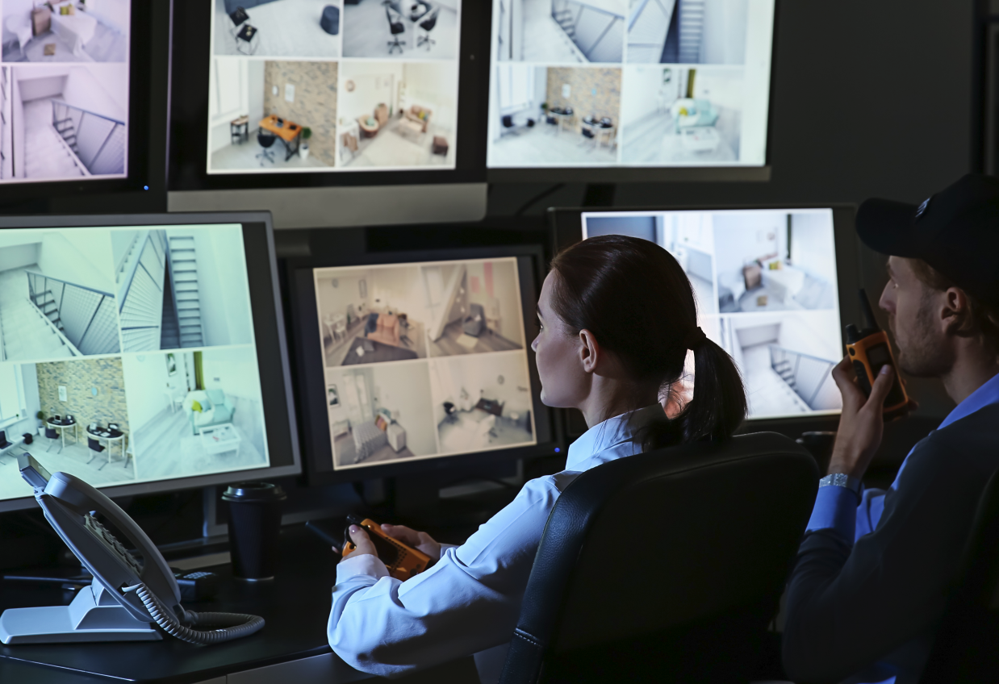
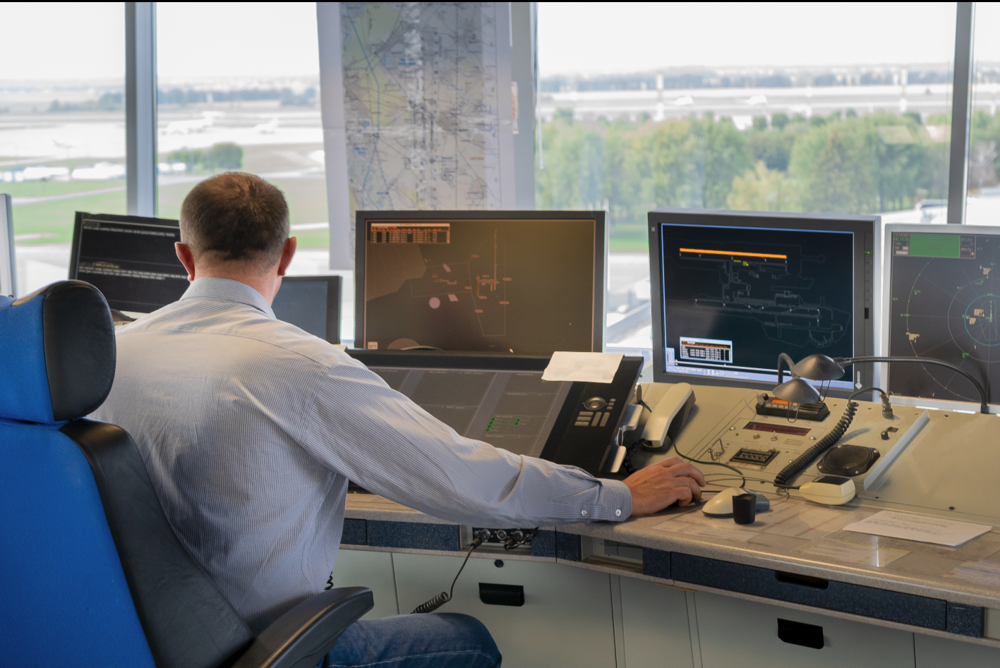
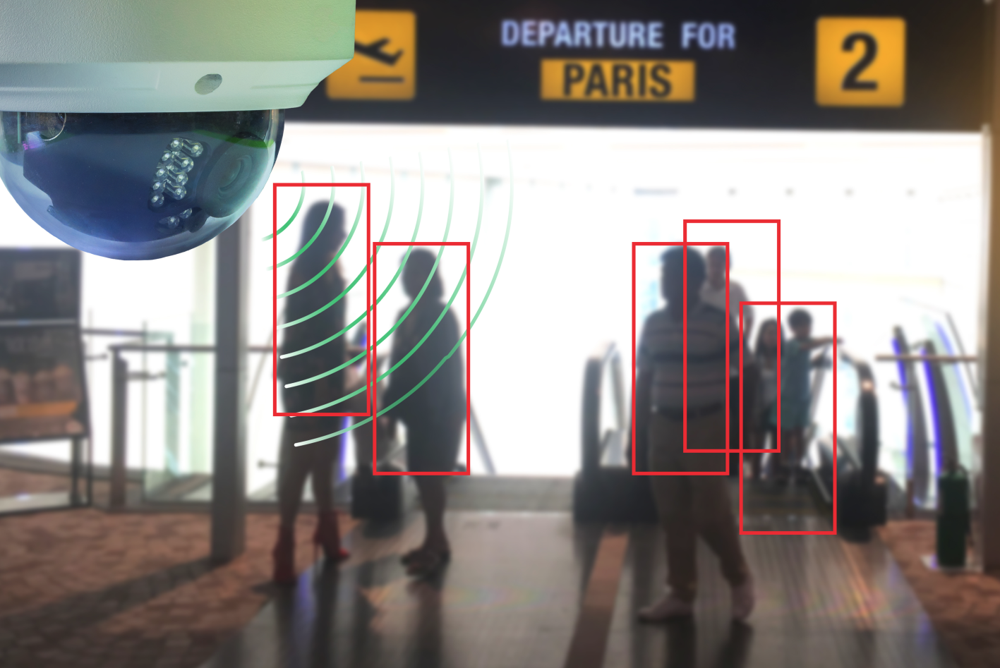
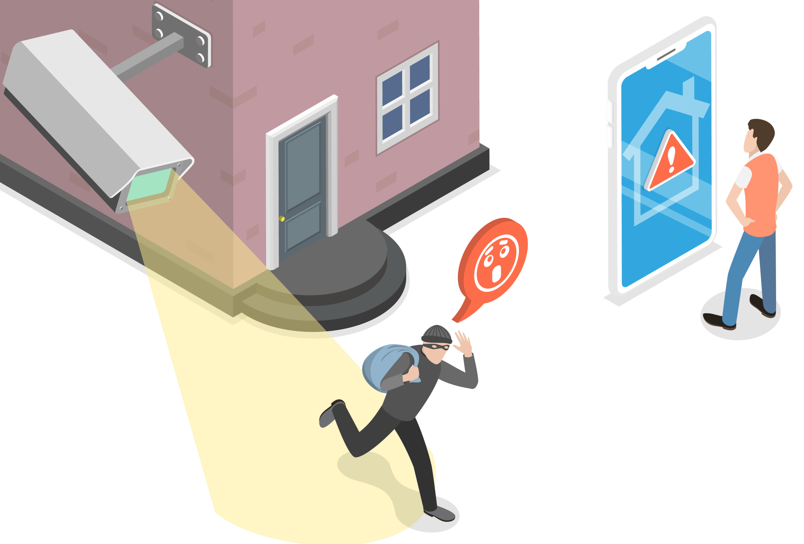
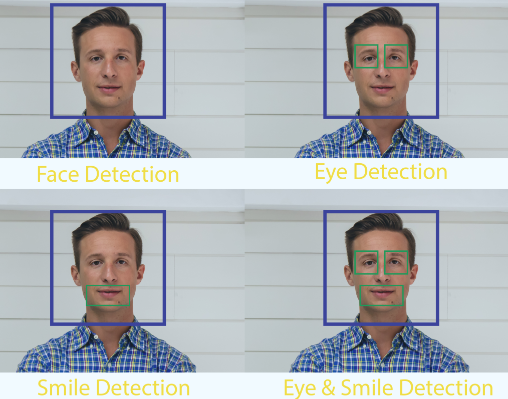
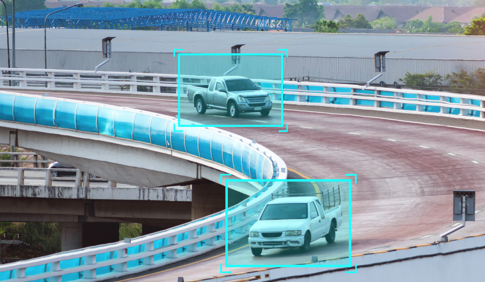
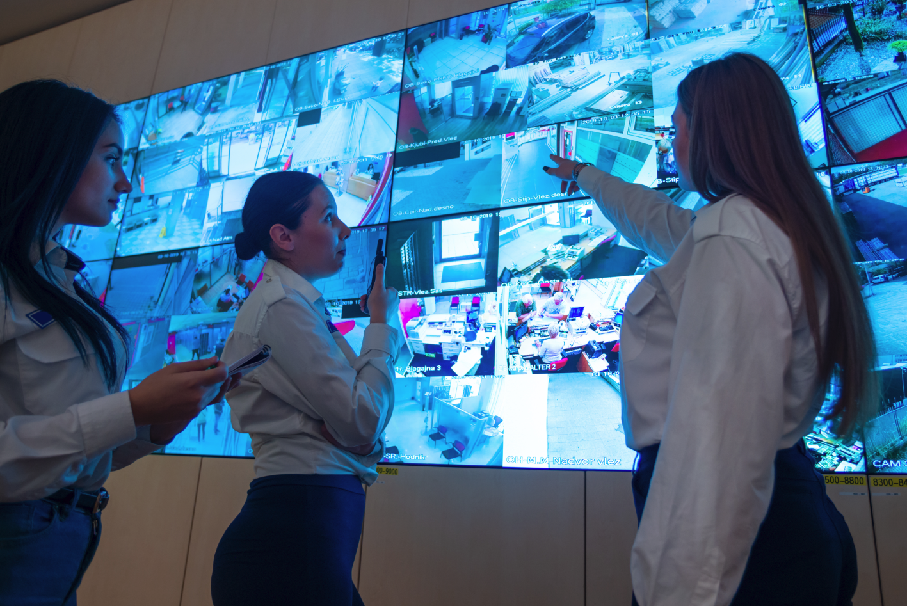
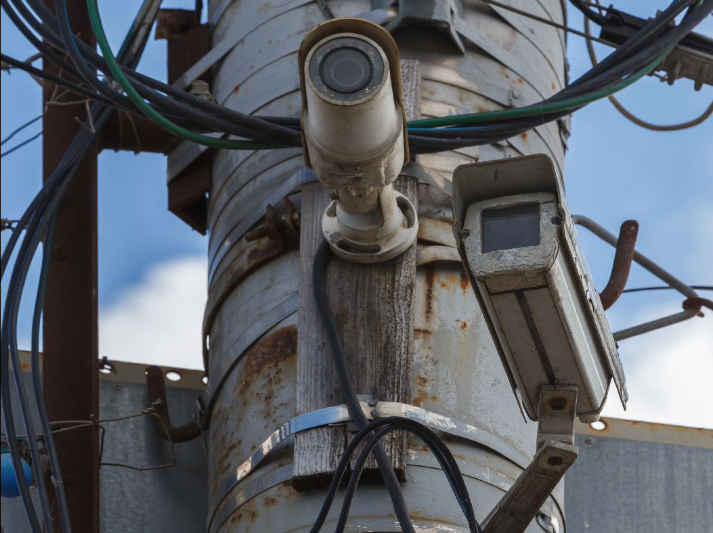
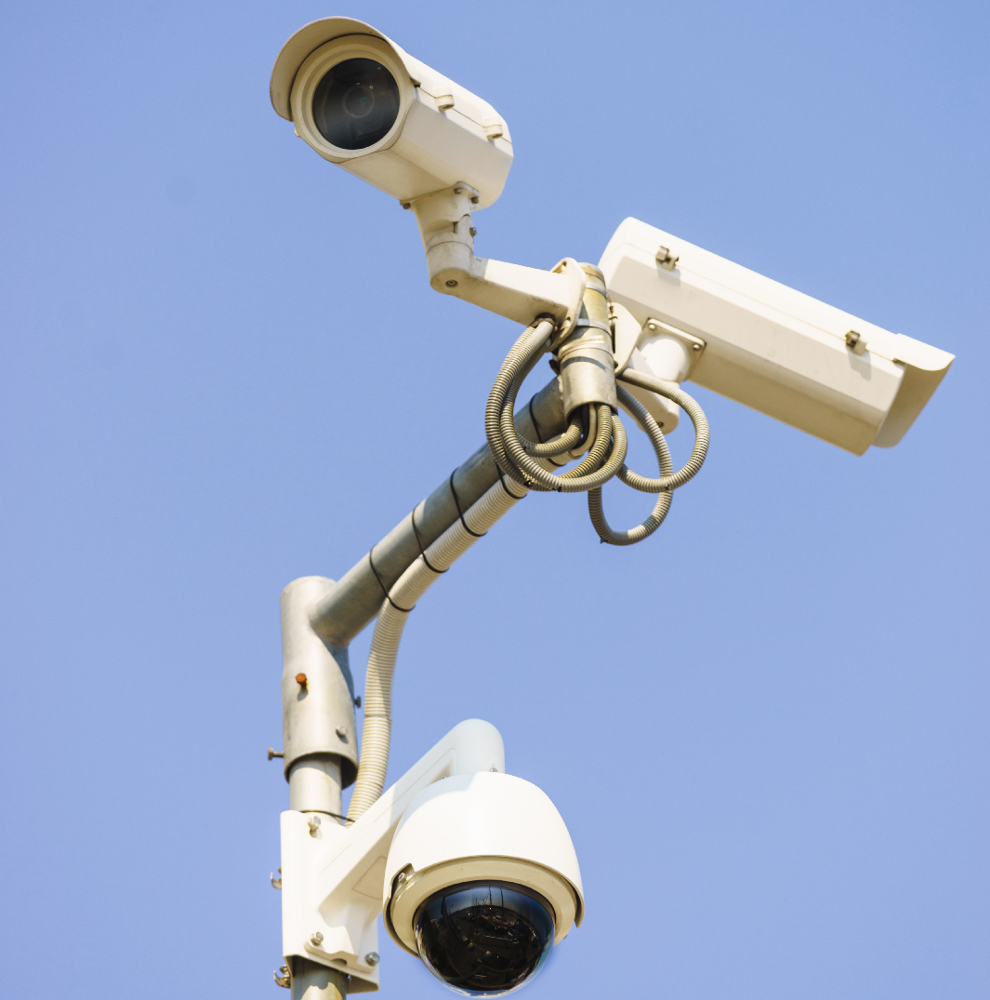

## [telemonit offer](https://offer.telemonit.com/)

The **telemonit** offering enables efficient management of work and task coordination regardless of geographical barriers, managing projects or teams remotely using communication technologies.

Remote supervision:
+ telemonitoring
+ telemedicine
+ telematics
+ privacy
+ surveillance

Discover a New Dimension of Security with Telemonit - Remote Supervision!

+ We're bridging the gap between technology and humans
+ We give cameras a voice to tell us what they see
+ We handle incidents from video analysis to legal support

Telemonit's Offering:

CameraMonit App
- Instant incident notifications
- Integration with popular messaging apps
#QuickResponse #MobileSecurity

Teleoperator App - Voice of Security
- Immediate notification and summoning of services: security, police, fire department
- Handling court cases after incidents
#ComprehensiveProtection #SecurityAssistant

CameraMind Device
- Integration of any camera system with our applications
- Universal solution for every security system
#UniversalIntegration #FlexibleSecurity

Experience the future of security with Telemonit! 

Want to learn more about our innovative solutions? Let's connect!

#Telemonit #RemoteSupervision #IntelligentSecurity #VoiceInteraction

## Smart Home

Detecting vandalism, theft

Standard monitoring with voice notification

## Industry 4.0

Optimizing the work of safety teams

Object control

Supporting the work of people monitoring objects and infrastructure

## Smart City

Monitoring people in public places

Remote personal monitoring

## Benefits

Quick telephone or messenger notification

Faster response and emergency calling

Person and Object Detection - object and person detection

Car detection - car detection

Reducing the number of people needed to make decisions, manage, and coordinate

Integration of old and new systems without additional infrastructure or camera investments

