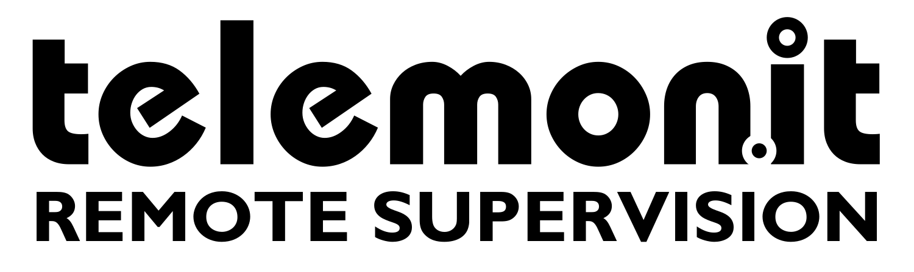
# [telemonit](https://www.telemonit.com/)

Oferta **telemonit** pozwala na efektywne zarządzanie pracą i koordynację zadań niezależnie od barier geograficznych, kierowanie projektem lub grupą osób z odległości, wykorzystując technologie komunikacyjne.

+ [CameraMonit - Surveillance Integration](http://www.cameramonit.com) - Rejestrator video z detekcją obiektów sterowany głosowo
+ [VoCo.Cam - Voice Controlled Camera](http://www.vococam.com)
+ [CameraMind - Detection and Notification](http://www.cameramind.com)
+ [Do.Camera - From Vision to Action](http://www.docamera.com)

Remote supervision:
+ telemonitoring
+ telemedycyna
+ telematyka
+ prywatnosc
+ nadzor

Standardowy monitoring z powiadamianiem głosowym

Twój elektroniczny stróż

Optymalizacja pracy zespołów bezpieczeństwa
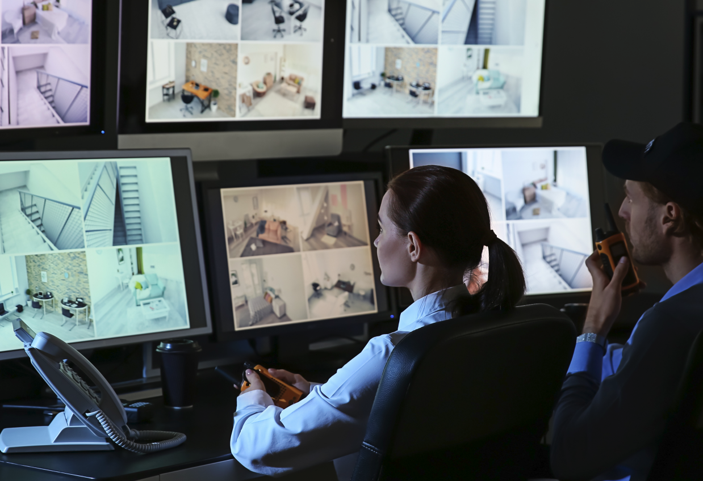

Zmniejszenie ilośći osób potrzebnych do podejmowania decyzji, zarządzania i koordynacji
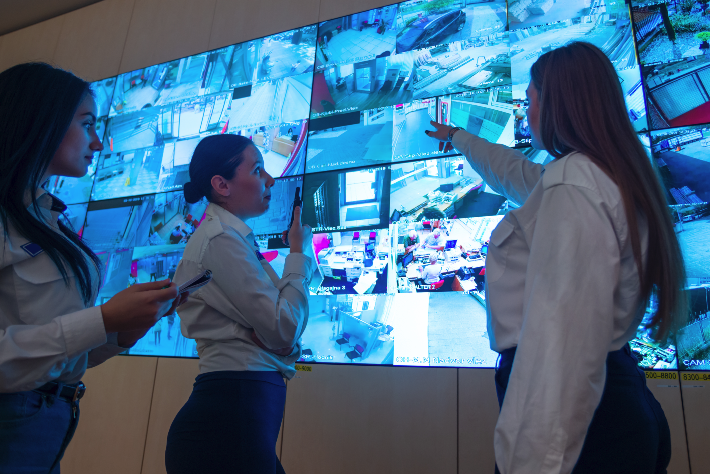

Person and Object Detection

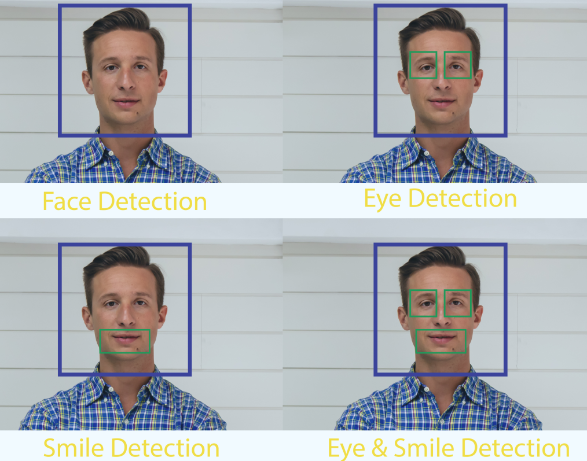

Car detection
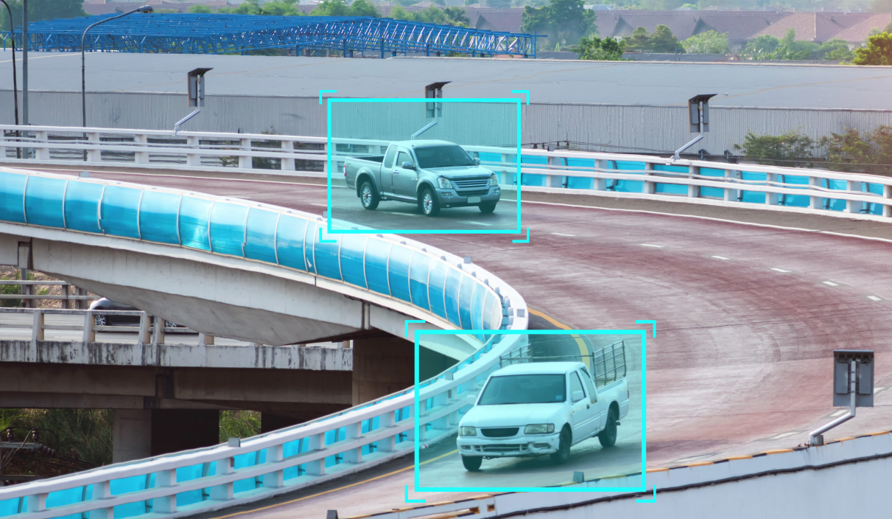

Wsparcie pracy osób nadzroujących obiekty i infrastrukturę

Kontrola osób w miejscach publicznych
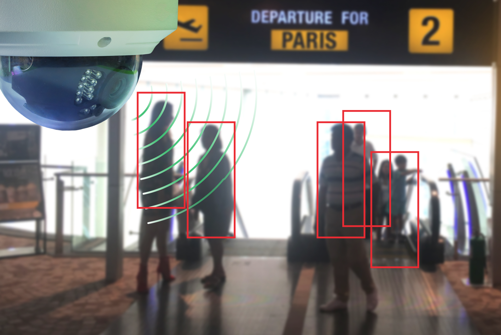

Zdalna kontrola osobista
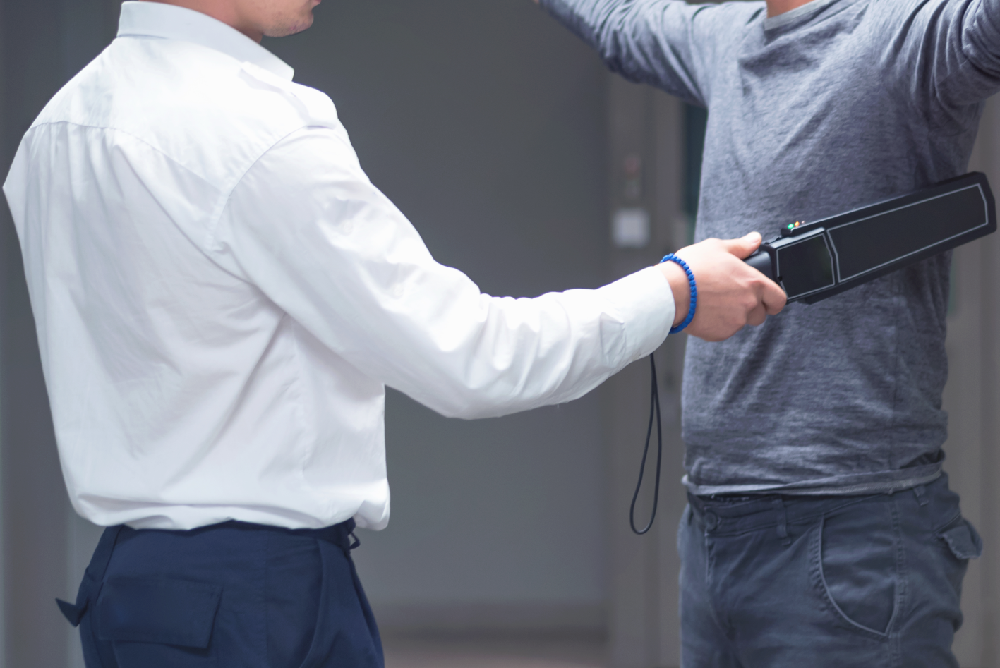

kontrola obiektów

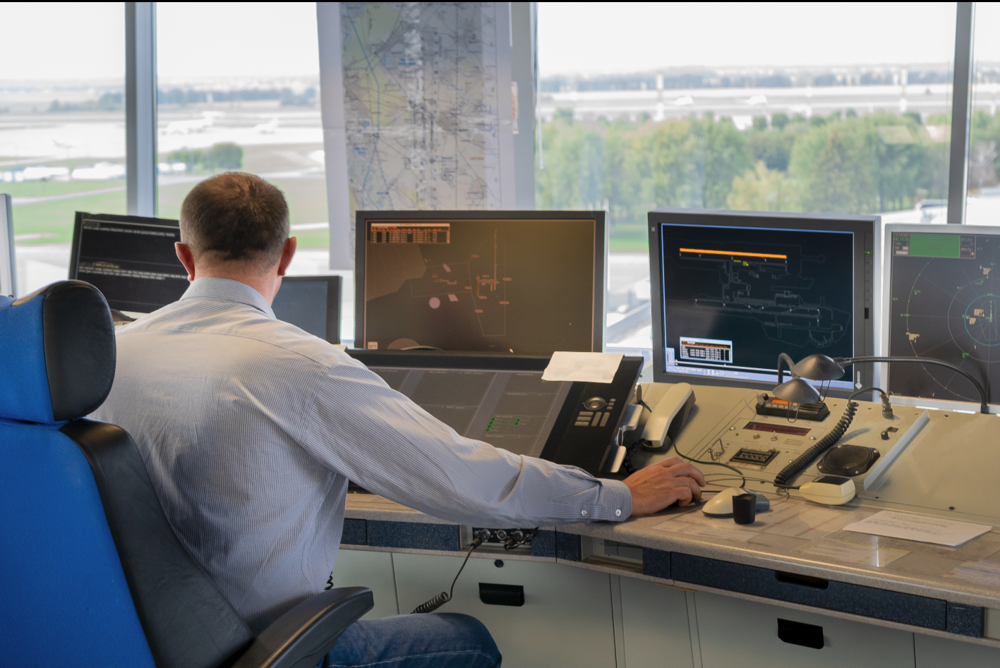

Wykrywanie wandalizmu, kradzieży

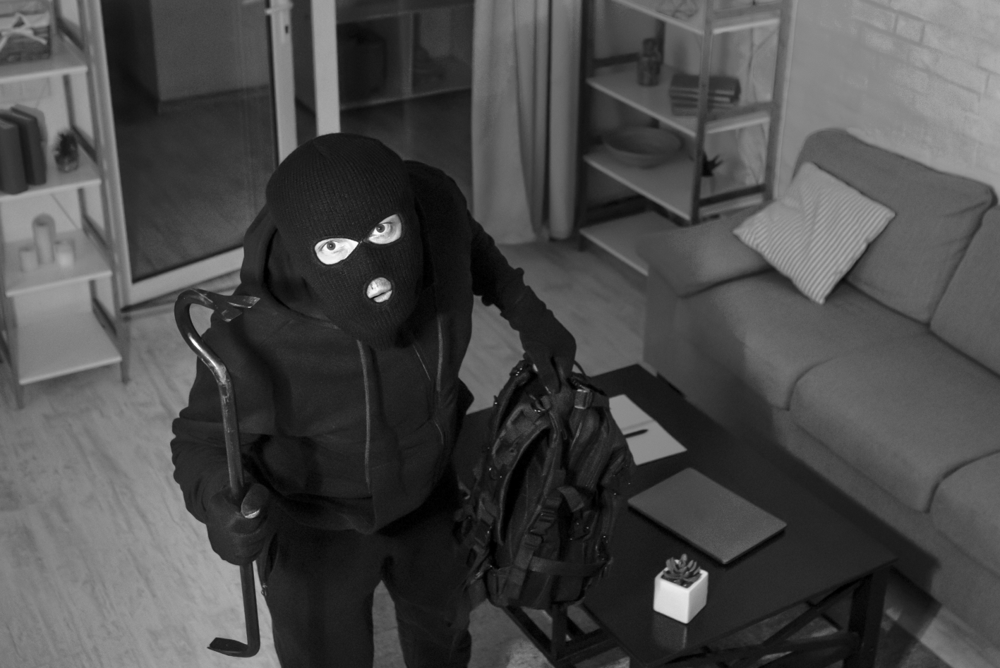

Szybkie powiadamianie telefoniczne lub na komunikatorze
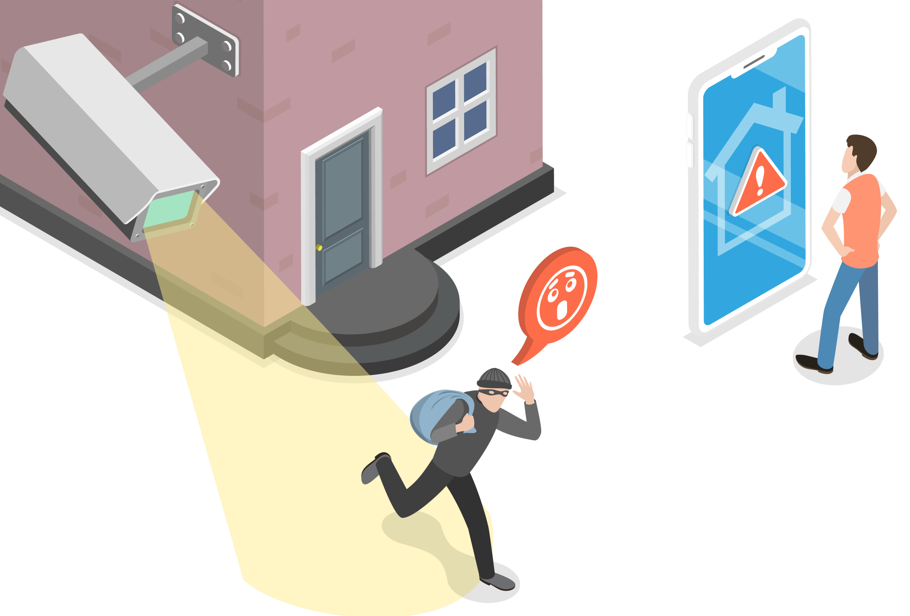

Integracja starych i nowych systemów bez dodatkowych iwestycji w infrastrukurę czy kamery
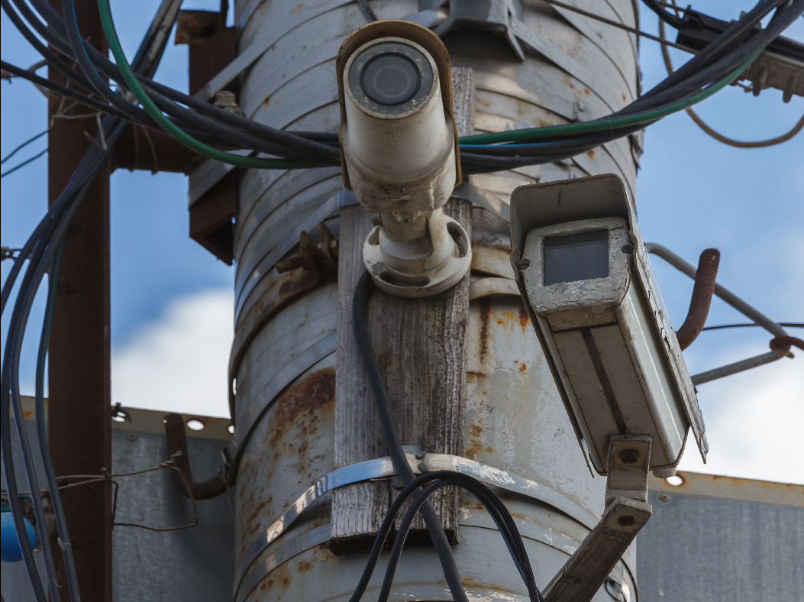

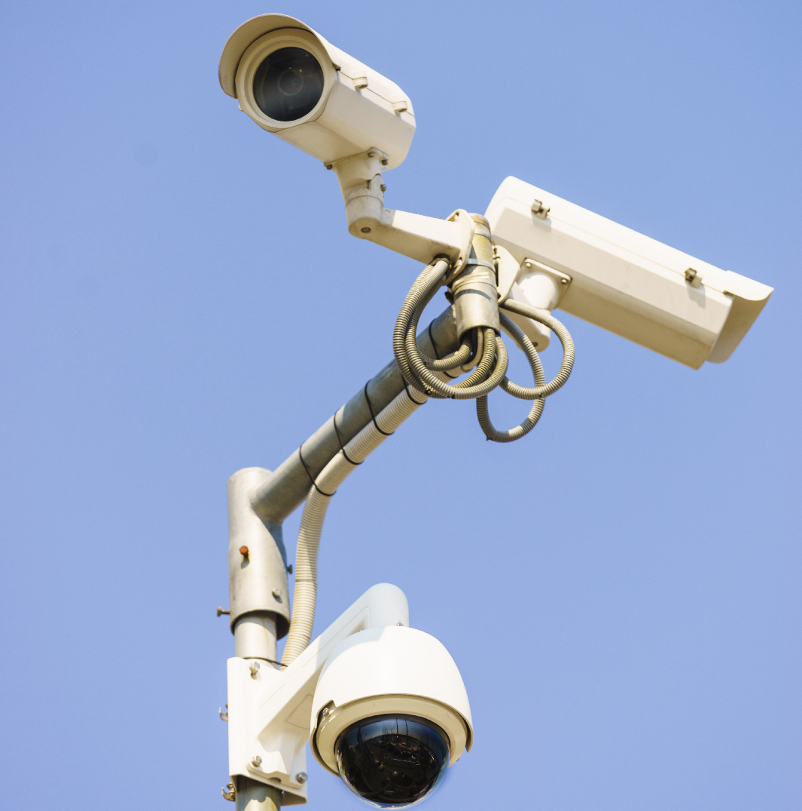

